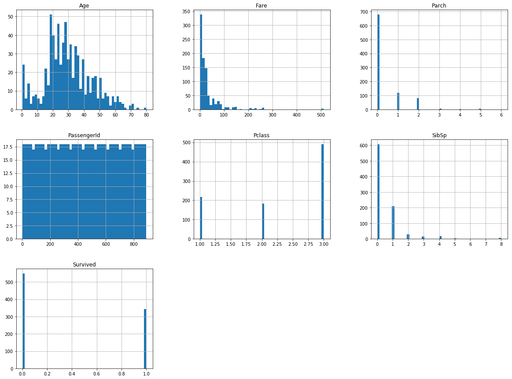
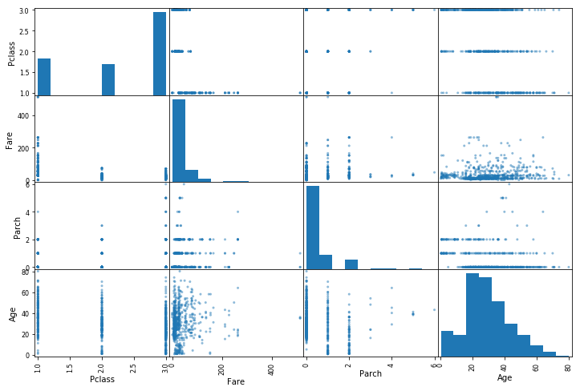

{}

Hello,

Après avoir débuté la lecture de [Machine Learning avec Scikit-Learn](https://www.amazon.fr/gp/product/210076540X/ref=as_li_tl?ie=UTF8&camp=1642&creative=6746&creativeASIN=210076540X&linkCode=as2&tag=deslivrepourm-21&linkId=a6c3ed7805af63613aaef46c12c5d31d"), j'ai pris au mot l'auteur dès la fin du deuxième chapitre et j'ai tenté d'appliquer la méthode sur des données "réelles".  
J'ai donc été sur le site [Kaggle](https://www.kaggle.com/c/titanic) qui propose (entre autre) un jeu de données pour débutant autour du Titanic, le but est de prédire les survivants. Bon, on se retrousse les manches, c'est parti !

{}{}

# Découverte des données

## Récupération des informations

L'ensemble des données est fourni dans deux fichiers CSV : *train.csv* pour nous permettre d'entrainer un modèle et *test.csv* qui nous permettra de valider (ou non) notre algorithme.

La librairie [Pandas](https://pandas.pydata.org/) nous permet facilement de charger des fichiers CSV :

{}{}


{}

```python
import pandas as pd

titanic = pd.read_csv('train.csv')
```

{}

{}{}

Regardons ce que contient notre fichier :

{}{}


{}

```python
titanic.head()
```

{}


<div>
<style scoped>
    .dataframe tbody tr th:only-of-type {
        vertical-align: middle;
    }

    .dataframe tbody tr th {
        vertical-align: top;
    }

    .dataframe thead th {
        text-align: right;
    }
</style>
<table border="1" class="dataframe">
  <thead>
    <tr style="text-align: right;">
      <th></th>
      <th>PassengerId</th>
      <th>Survived</th>
      <th>Pclass</th>
      <th>Name</th>
      <th>Sex</th>
      <th>Age</th>
      <th>SibSp</th>
      <th>Parch</th>
      <th>Ticket</th>
      <th>Fare</th>
      <th>Cabin</th>
      <th>Embarked</th>
    </tr>
  </thead>
  <tbody>
    <tr>
      <th>0</th>
      <td>1</td>
      <td>0</td>
      <td>3</td>
      <td>Braund, Mr. Owen Harris</td>
      <td>male</td>
      <td>22.0</td>
      <td>1</td>
      <td>0</td>
      <td>A/5 21171</td>
      <td>7.2500</td>
      <td>NaN</td>
      <td>S</td>
    </tr>
    <tr>
      <th>1</th>
      <td>2</td>
      <td>1</td>
      <td>1</td>
      <td>Cumings, Mrs. John Bradley (Florence Briggs Th...</td>
      <td>female</td>
      <td>38.0</td>
      <td>1</td>
      <td>0</td>
      <td>PC 17599</td>
      <td>71.2833</td>
      <td>C85</td>
      <td>C</td>
    </tr>
    <tr>
      <th>2</th>
      <td>3</td>
      <td>1</td>
      <td>3</td>
      <td>Heikkinen, Miss. Laina</td>
      <td>female</td>
      <td>26.0</td>
      <td>0</td>
      <td>0</td>
      <td>STON/O2. 3101282</td>
      <td>7.9250</td>
      <td>NaN</td>
      <td>S</td>
    </tr>
    <tr>
      <th>3</th>
      <td>4</td>
      <td>1</td>
      <td>1</td>
      <td>Futrelle, Mrs. Jacques Heath (Lily May Peel)</td>
      <td>female</td>
      <td>35.0</td>
      <td>1</td>
      <td>0</td>
      <td>113803</td>
      <td>53.1000</td>
      <td>C123</td>
      <td>S</td>
    </tr>
    <tr>
      <th>4</th>
      <td>5</td>
      <td>0</td>
      <td>3</td>
      <td>Allen, Mr. William Henry</td>
      <td>male</td>
      <td>35.0</td>
      <td>0</td>
      <td>0</td>
      <td>373450</td>
      <td>8.0500</td>
      <td>NaN</td>
      <td>S</td>
    </tr>
  </tbody>
</table>
</div>


{}{}

Les données semblent cohérentes, regardons cela un peu plus en détails.

{}{}

## Description des données

On utilise la fonction [info](https://pandas.pydata.org/pandas-docs/stable/generated/pandas.DataFrame.info.html) qui nous donne un résumé des différentes variables : 

{}{}


{}

```python
titanic.info()
```

{}

    <class 'pandas.core.frame.DataFrame'>
    RangeIndex: 891 entries, 0 to 890
    Data columns (total 12 columns):
    PassengerId    891 non-null int64
    Survived       891 non-null int64
    Pclass         891 non-null int64
    Name           891 non-null object
    Sex            891 non-null object
    Age            714 non-null float64
    SibSp          891 non-null int64
    Parch          891 non-null int64
    Ticket         891 non-null object
    Fare           891 non-null float64
    Cabin          204 non-null object
    Embarked       889 non-null object
    dtypes: float64(2), int64(5), object(5)
    memory usage: 83.6+ KB


{}{}

Chaque valeur représente :
* PassengerID : un numéro d'identifiant
* Survived : 0 si ce passager n'a pas survécu, 1 dans le cas contraire
* Pclass : la classe dans laquelle ce passager a voyagé (1, 2 ou 3)
* Name : le nom
* Sex : femme ou homme (male ou female)
* Age : l'âge (en années)
* SibSp : le nombre de frère, soeur et/ou épouse à bord
* Parch : le nombre de parent et/ou d'enfant à bord
* Ticket : numéro du ticket
* Fare : prix du billet
* Cabin : numéro de cabine
* Embarked : port d'embarquement(C = Cherbourg, Q = Queenstown, S = Southampton)

Il y a quelques valeurs qui ne sont pas numériques (*Name*, *Sex*, *Ticket*, *Cabin* et *Embarked*). Il faut donc soit s'en séparer, soit les convertir. Ici, je pense me séparer de toutes (ce choix est tout à fait arbitraire, j'estime que ces données ne sont pas pertinentes pour déterminer si oui ou non ce passager survivra) sauf la variable *Sex* que je vais convertir (plus loin) en une variable binaire (0 ou 1), en associant par exemple female=0 et male=1.  
*Edit* : au final, ca sera un peu différent avec une colonne pour *male* (valeur à 1 si c'est un homme, 0 sinon) et une autre pour *female* avec le même principe.

Il y a également un autre problème. Il y a 891 passagers répertoriés mais pour la variable *Age*, il n'y a que 714 valeurs. Il va falloir trouver une solution pour remplir les données manquantes car les algorithmes de machine learning (ML) ne peuvent pas travailler sur des données vides.

Examinons un peu plus nos données avec la fonction [describe](https://pandas.pydata.org/pandas-docs/stable/generated/pandas.DataFrame.describe.html) qui nous donne un petit tableau récapitulatif de quelques données statistiques de base :

{}{}


{}

```python
titanic.describe()
```

{}


<div>
<style scoped>
    .dataframe tbody tr th:only-of-type {
        vertical-align: middle;
    }

    .dataframe tbody tr th {
        vertical-align: top;
    }

    .dataframe thead th {
        text-align: right;
    }
</style>
<table border="1" class="dataframe">
  <thead>
    <tr style="text-align: right;">
      <th></th>
      <th>PassengerId</th>
      <th>Survived</th>
      <th>Pclass</th>
      <th>Age</th>
      <th>SibSp</th>
      <th>Parch</th>
      <th>Fare</th>
    </tr>
  </thead>
  <tbody>
    <tr>
      <th>count</th>
      <td>891.000000</td>
      <td>891.000000</td>
      <td>891.000000</td>
      <td>714.000000</td>
      <td>891.000000</td>
      <td>891.000000</td>
      <td>891.000000</td>
    </tr>
    <tr>
      <th>mean</th>
      <td>446.000000</td>
      <td>0.383838</td>
      <td>2.308642</td>
      <td>29.699118</td>
      <td>0.523008</td>
      <td>0.381594</td>
      <td>32.204208</td>
    </tr>
    <tr>
      <th>std</th>
      <td>257.353842</td>
      <td>0.486592</td>
      <td>0.836071</td>
      <td>14.526497</td>
      <td>1.102743</td>
      <td>0.806057</td>
      <td>49.693429</td>
    </tr>
    <tr>
      <th>min</th>
      <td>1.000000</td>
      <td>0.000000</td>
      <td>1.000000</td>
      <td>0.420000</td>
      <td>0.000000</td>
      <td>0.000000</td>
      <td>0.000000</td>
    </tr>
    <tr>
      <th>25%</th>
      <td>223.500000</td>
      <td>0.000000</td>
      <td>2.000000</td>
      <td>20.125000</td>
      <td>0.000000</td>
      <td>0.000000</td>
      <td>7.910400</td>
    </tr>
    <tr>
      <th>50%</th>
      <td>446.000000</td>
      <td>0.000000</td>
      <td>3.000000</td>
      <td>28.000000</td>
      <td>0.000000</td>
      <td>0.000000</td>
      <td>14.454200</td>
    </tr>
    <tr>
      <th>75%</th>
      <td>668.500000</td>
      <td>1.000000</td>
      <td>3.000000</td>
      <td>38.000000</td>
      <td>1.000000</td>
      <td>0.000000</td>
      <td>31.000000</td>
    </tr>
    <tr>
      <th>max</th>
      <td>891.000000</td>
      <td>1.000000</td>
      <td>3.000000</td>
      <td>80.000000</td>
      <td>8.000000</td>
      <td>6.000000</td>
      <td>512.329200</td>
    </tr>
  </tbody>
</table>
</div>


{}{}

On remarque tout d'abord que la fonction élimine toutes les variables non-numériques.  
Autre point, pour *Fare*, il semble y avoir une valeur maximale très forte (512,3292) au regard de la moyenne (*mean*) qui est de 32,204. Il faudra donc voir s'il s'agit d'une fausse valeur et si oui, comment on la traite (élimination de celle-ci, remplacement par la moyenne ?).

{}{}

### Histogrammes des données

Pour avoir une vision graphique des valeurs, nous allons utiliser la librairie [Matplotlib](https://matplotlib.org/) pour afficher les histogrammes des valeurs numériques :

{}{}


{}

```python
# chargement de la librairie dans un notebook Jupyter
%matplotlib inline  
import matplotlib.pyplot as plt

titanic.hist(bins=50, figsize=(20,15))
plt.show()
```

{}





{}{}

#### Quelques remarques sur ces graphiques

1. Les âges semblent répartis à peu près de façon gaussienne, on notera toutefois le pic de valeur vers 0 : s'agit-il d'une valeur par défaut ou il y un forte proportion de nouveaux nés dans nos données ?
2. Concernant les tarifs (*Fare*), on constate de nouveau un pic très important au tout début, ce qui semble écraser les autres valeurs.
3. Il y a une forme de similarité entre *Parch* et *SibSp*, il y a peut-être une possibilité de simplifier ces valeurs ?

Pour essayer de répondre à la question 1, utilisons la fonction [sort_values](https://pandas.pydata.org/pandas-docs/stable/generated/pandas.DataFrame.sort_values.html) à laquelle on va lui demander de nous trier les données selon l'âge (paramètre *by=*), dans l'ordre croissant (paramètre *ascending=True*) et seulement les 10 premières valeurs (*[:10]*, fonctionne comme le *slicing* Python) :

{}{}


{}

```python
titanic.sort_values(by=['Age'], ascending=True)[:10]
```

{}


<div>
<style scoped>
    .dataframe tbody tr th:only-of-type {
        vertical-align: middle;
    }

    .dataframe tbody tr th {
        vertical-align: top;
    }

    .dataframe thead th {
        text-align: right;
    }
</style>
<table border="1" class="dataframe">
  <thead>
    <tr style="text-align: right;">
      <th></th>
      <th>PassengerId</th>
      <th>Survived</th>
      <th>Pclass</th>
      <th>Name</th>
      <th>Sex</th>
      <th>Age</th>
      <th>SibSp</th>
      <th>Parch</th>
      <th>Ticket</th>
      <th>Fare</th>
      <th>Cabin</th>
      <th>Embarked</th>
    </tr>
  </thead>
  <tbody>
    <tr>
      <th>803</th>
      <td>804</td>
      <td>1</td>
      <td>3</td>
      <td>Thomas, Master. Assad Alexander</td>
      <td>male</td>
      <td>0.42</td>
      <td>0</td>
      <td>1</td>
      <td>2625</td>
      <td>8.5167</td>
      <td>NaN</td>
      <td>C</td>
    </tr>
    <tr>
      <th>755</th>
      <td>756</td>
      <td>1</td>
      <td>2</td>
      <td>Hamalainen, Master. Viljo</td>
      <td>male</td>
      <td>0.67</td>
      <td>1</td>
      <td>1</td>
      <td>250649</td>
      <td>14.5000</td>
      <td>NaN</td>
      <td>S</td>
    </tr>
    <tr>
      <th>644</th>
      <td>645</td>
      <td>1</td>
      <td>3</td>
      <td>Baclini, Miss. Eugenie</td>
      <td>female</td>
      <td>0.75</td>
      <td>2</td>
      <td>1</td>
      <td>2666</td>
      <td>19.2583</td>
      <td>NaN</td>
      <td>C</td>
    </tr>
    <tr>
      <th>469</th>
      <td>470</td>
      <td>1</td>
      <td>3</td>
      <td>Baclini, Miss. Helene Barbara</td>
      <td>female</td>
      <td>0.75</td>
      <td>2</td>
      <td>1</td>
      <td>2666</td>
      <td>19.2583</td>
      <td>NaN</td>
      <td>C</td>
    </tr>
    <tr>
      <th>78</th>
      <td>79</td>
      <td>1</td>
      <td>2</td>
      <td>Caldwell, Master. Alden Gates</td>
      <td>male</td>
      <td>0.83</td>
      <td>0</td>
      <td>2</td>
      <td>248738</td>
      <td>29.0000</td>
      <td>NaN</td>
      <td>S</td>
    </tr>
    <tr>
      <th>831</th>
      <td>832</td>
      <td>1</td>
      <td>2</td>
      <td>Richards, Master. George Sibley</td>
      <td>male</td>
      <td>0.83</td>
      <td>1</td>
      <td>1</td>
      <td>29106</td>
      <td>18.7500</td>
      <td>NaN</td>
      <td>S</td>
    </tr>
    <tr>
      <th>305</th>
      <td>306</td>
      <td>1</td>
      <td>1</td>
      <td>Allison, Master. Hudson Trevor</td>
      <td>male</td>
      <td>0.92</td>
      <td>1</td>
      <td>2</td>
      <td>113781</td>
      <td>151.5500</td>
      <td>C22 C26</td>
      <td>S</td>
    </tr>
    <tr>
      <th>827</th>
      <td>828</td>
      <td>1</td>
      <td>2</td>
      <td>Mallet, Master. Andre</td>
      <td>male</td>
      <td>1.00</td>
      <td>0</td>
      <td>2</td>
      <td>S.C./PARIS 2079</td>
      <td>37.0042</td>
      <td>NaN</td>
      <td>C</td>
    </tr>
    <tr>
      <th>381</th>
      <td>382</td>
      <td>1</td>
      <td>3</td>
      <td>Nakid, Miss. Maria ("Mary")</td>
      <td>female</td>
      <td>1.00</td>
      <td>0</td>
      <td>2</td>
      <td>2653</td>
      <td>15.7417</td>
      <td>NaN</td>
      <td>C</td>
    </tr>
    <tr>
      <th>164</th>
      <td>165</td>
      <td>0</td>
      <td>3</td>
      <td>Panula, Master. Eino Viljami</td>
      <td>male</td>
      <td>1.00</td>
      <td>4</td>
      <td>1</td>
      <td>3101295</td>
      <td>39.6875</td>
      <td>NaN</td>
      <td>S</td>
    </tr>
  </tbody>
</table>
</div>


{}{}

Tout compte fait, il n'y a pas d'incohérence, juste une forte proportion de nouveaux nés à bord.

Dans le même ordre d'idée, regardons les données sur le tarif des billets :

{}{}


{}

```python
titanic.sort_values(by=['Fare'], ascending=False)[:10]
```

{}


<div>
<style scoped>
    .dataframe tbody tr th:only-of-type {
        vertical-align: middle;
    }

    .dataframe tbody tr th {
        vertical-align: top;
    }

    .dataframe thead th {
        text-align: right;
    }
</style>
<table border="1" class="dataframe">
  <thead>
    <tr style="text-align: right;">
      <th></th>
      <th>PassengerId</th>
      <th>Survived</th>
      <th>Pclass</th>
      <th>Name</th>
      <th>Sex</th>
      <th>Age</th>
      <th>SibSp</th>
      <th>Parch</th>
      <th>Ticket</th>
      <th>Fare</th>
      <th>Cabin</th>
      <th>Embarked</th>
    </tr>
  </thead>
  <tbody>
    <tr>
      <th>258</th>
      <td>259</td>
      <td>1</td>
      <td>1</td>
      <td>Ward, Miss. Anna</td>
      <td>female</td>
      <td>35.0</td>
      <td>0</td>
      <td>0</td>
      <td>PC 17755</td>
      <td>512.3292</td>
      <td>NaN</td>
      <td>C</td>
    </tr>
    <tr>
      <th>737</th>
      <td>738</td>
      <td>1</td>
      <td>1</td>
      <td>Lesurer, Mr. Gustave J</td>
      <td>male</td>
      <td>35.0</td>
      <td>0</td>
      <td>0</td>
      <td>PC 17755</td>
      <td>512.3292</td>
      <td>B101</td>
      <td>C</td>
    </tr>
    <tr>
      <th>679</th>
      <td>680</td>
      <td>1</td>
      <td>1</td>
      <td>Cardeza, Mr. Thomas Drake Martinez</td>
      <td>male</td>
      <td>36.0</td>
      <td>0</td>
      <td>1</td>
      <td>PC 17755</td>
      <td>512.3292</td>
      <td>B51 B53 B55</td>
      <td>C</td>
    </tr>
    <tr>
      <th>88</th>
      <td>89</td>
      <td>1</td>
      <td>1</td>
      <td>Fortune, Miss. Mabel Helen</td>
      <td>female</td>
      <td>23.0</td>
      <td>3</td>
      <td>2</td>
      <td>19950</td>
      <td>263.0000</td>
      <td>C23 C25 C27</td>
      <td>S</td>
    </tr>
    <tr>
      <th>27</th>
      <td>28</td>
      <td>0</td>
      <td>1</td>
      <td>Fortune, Mr. Charles Alexander</td>
      <td>male</td>
      <td>19.0</td>
      <td>3</td>
      <td>2</td>
      <td>19950</td>
      <td>263.0000</td>
      <td>C23 C25 C27</td>
      <td>S</td>
    </tr>
    <tr>
      <th>341</th>
      <td>342</td>
      <td>1</td>
      <td>1</td>
      <td>Fortune, Miss. Alice Elizabeth</td>
      <td>female</td>
      <td>24.0</td>
      <td>3</td>
      <td>2</td>
      <td>19950</td>
      <td>263.0000</td>
      <td>C23 C25 C27</td>
      <td>S</td>
    </tr>
    <tr>
      <th>438</th>
      <td>439</td>
      <td>0</td>
      <td>1</td>
      <td>Fortune, Mr. Mark</td>
      <td>male</td>
      <td>64.0</td>
      <td>1</td>
      <td>4</td>
      <td>19950</td>
      <td>263.0000</td>
      <td>C23 C25 C27</td>
      <td>S</td>
    </tr>
    <tr>
      <th>311</th>
      <td>312</td>
      <td>1</td>
      <td>1</td>
      <td>Ryerson, Miss. Emily Borie</td>
      <td>female</td>
      <td>18.0</td>
      <td>2</td>
      <td>2</td>
      <td>PC 17608</td>
      <td>262.3750</td>
      <td>B57 B59 B63 B66</td>
      <td>C</td>
    </tr>
    <tr>
      <th>742</th>
      <td>743</td>
      <td>1</td>
      <td>1</td>
      <td>Ryerson, Miss. Susan Parker "Suzette"</td>
      <td>female</td>
      <td>21.0</td>
      <td>2</td>
      <td>2</td>
      <td>PC 17608</td>
      <td>262.3750</td>
      <td>B57 B59 B63 B66</td>
      <td>C</td>
    </tr>
    <tr>
      <th>118</th>
      <td>119</td>
      <td>0</td>
      <td>1</td>
      <td>Baxter, Mr. Quigg Edmond</td>
      <td>male</td>
      <td>24.0</td>
      <td>0</td>
      <td>1</td>
      <td>PC 17558</td>
      <td>247.5208</td>
      <td>B58 B60</td>
      <td>C</td>
    </tr>
  </tbody>
</table>
</div>


{}{}

Finalement, c'est cohérent : les tarifs les plus élevés sont ceux des passagers de la première classe.  
  
Passons à l'étape suivante !

{}{}

## Recherche de corrélations
Le but est ici de voir s'il n'existe pas de corrélations entre différentes valeurs. On utilise pour cela la fonction [corr](https://pandas.pydata.org/pandas-docs/stable/generated/pandas.DataFrame.corr.html) :

{}{}


{}

```python
titanic.corr()
```

{}


<div>
<style scoped>
    .dataframe tbody tr th:only-of-type {
        vertical-align: middle;
    }

    .dataframe tbody tr th {
        vertical-align: top;
    }

    .dataframe thead th {
        text-align: right;
    }
</style>
<table border="1" class="dataframe">
  <thead>
    <tr style="text-align: right;">
      <th></th>
      <th>PassengerId</th>
      <th>Survived</th>
      <th>Pclass</th>
      <th>Age</th>
      <th>SibSp</th>
      <th>Parch</th>
      <th>Fare</th>
    </tr>
  </thead>
  <tbody>
    <tr>
      <th>PassengerId</th>
      <td>1.000000</td>
      <td>-0.005007</td>
      <td>-0.035144</td>
      <td>0.036847</td>
      <td>-0.057527</td>
      <td>-0.001652</td>
      <td>0.012658</td>
    </tr>
    <tr>
      <th>Survived</th>
      <td>-0.005007</td>
      <td>1.000000</td>
      <td>-0.338481</td>
      <td>-0.077221</td>
      <td>-0.035322</td>
      <td>0.081629</td>
      <td>0.257307</td>
    </tr>
    <tr>
      <th>Pclass</th>
      <td>-0.035144</td>
      <td>-0.338481</td>
      <td>1.000000</td>
      <td>-0.369226</td>
      <td>0.083081</td>
      <td>0.018443</td>
      <td>-0.549500</td>
    </tr>
    <tr>
      <th>Age</th>
      <td>0.036847</td>
      <td>-0.077221</td>
      <td>-0.369226</td>
      <td>1.000000</td>
      <td>-0.308247</td>
      <td>-0.189119</td>
      <td>0.096067</td>
    </tr>
    <tr>
      <th>SibSp</th>
      <td>-0.057527</td>
      <td>-0.035322</td>
      <td>0.083081</td>
      <td>-0.308247</td>
      <td>1.000000</td>
      <td>0.414838</td>
      <td>0.159651</td>
    </tr>
    <tr>
      <th>Parch</th>
      <td>-0.001652</td>
      <td>0.081629</td>
      <td>0.018443</td>
      <td>-0.189119</td>
      <td>0.414838</td>
      <td>1.000000</td>
      <td>0.216225</td>
    </tr>
    <tr>
      <th>Fare</th>
      <td>0.012658</td>
      <td>0.257307</td>
      <td>-0.549500</td>
      <td>0.096067</td>
      <td>0.159651</td>
      <td>0.216225</td>
      <td>1.000000</td>
    </tr>
  </tbody>
</table>
</div>


{}{}

On va s'intéresser principalement à la colonne *Survived* puisqu'il s'agit de notre variable à expliquer. Il y un coefficient de corrélation qui semble intéressant avec *Pclass* (-0,33), *Fare* (0,25) et peut-être avec *Parch* ou *Age*. Pour regarder cela graphiquement, on utilise la fonction [scatter_matrix](https://pandas.pydata.org/pandas-docs/stable/visualization.html#scatter-matrix-plot) du module *plotting* de *Pandas* :

{}{}


{}

```python
from pandas.plotting import scatter_matrix

attrs = ['Pclass', 'Fare', 'Parch', 'Age']
scatter_matrix(titanic[attrs], figsize=(12,8))
```

{}


    array([[<matplotlib.axes._subplots.AxesSubplot object at 0x10864a2e8>,
            <matplotlib.axes._subplots.AxesSubplot object at 0x108631710>,
            <matplotlib.axes._subplots.AxesSubplot object at 0x1086aea58>,
            <matplotlib.axes._subplots.AxesSubplot object at 0x107c7ce10>],
           [<matplotlib.axes._subplots.AxesSubplot object at 0x107c9b2e8>,
            <matplotlib.axes._subplots.AxesSubplot object at 0x107c9ba90>,
            <matplotlib.axes._subplots.AxesSubplot object at 0x107d3be10>,
            <matplotlib.axes._subplots.AxesSubplot object at 0x107e8e0b8>],
           [<matplotlib.axes._subplots.AxesSubplot object at 0x108694518>,
            <matplotlib.axes._subplots.AxesSubplot object at 0x1086ce6d8>,
            <matplotlib.axes._subplots.AxesSubplot object at 0x107cad5f8>,
            <matplotlib.axes._subplots.AxesSubplot object at 0x108744ac8>],
           [<matplotlib.axes._subplots.AxesSubplot object at 0x108662048>,
            <matplotlib.axes._subplots.AxesSubplot object at 0x107a73e10>,
            <matplotlib.axes._subplots.AxesSubplot object at 0x107c4c0b8>,
            <matplotlib.axes._subplots.AxesSubplot object at 0x107ae2438>]], dtype=object)





{}{}

Bon, décevant :(. La colonne *Pclass* contient que des 1, 2 ou 3, ce qui rassemble les données sur 3 colonnes. A ce stade, je n'en déduit rien qui puisse m'aider à prédire si oui ou non cette personne survivra.  
Il est de temps de passer à la préparation des données afin de pouvoir automatiser tout le processus. Ceci permet dans le cas où des nouvelles données apparaissent, de les mettre directement en forme pour l'algorithme.

{}{}

# Préparation des données

Puisque nous allons utiliser un algorithme d'apprentissage supervisé (puisque nous connaissons les valeurs à obtenir), il nous faut séparer les *labels* (la réponse attendu en fait) des données :

{}{}


{}

```python
labels = titanic["Survived"]
```

{}

{}{}

Il faut maintenant préparer les données selon nos observations précédentes, c'est à dire :
1. retirer les colonnes *Name*, *Ticket*, *Cabin*, *Embarked*, et *PassengerId* qui ne nous sert à rien pour la prédiction; on retire également *Survived* puisque nous avons récupérer les étiquettes,
2. coder en binaire s'il s'agit de femme ou d'homme,
3. remplir les valeurs d'âge manquantes,
4. étape supplémentaire : recalibrer les données (on en parlera plus loin).

{}{}

## Retirer des colonnes

On utilise la fonction [drop](https://pandas.pydata.org/pandas-docs/stable/generated/pandas.DataFrame.drop.html) qui renvoi un *Dataframe* sans les colonnes voulues :

{}{}


{}

```python
data_without_columns = titanic.drop(["Name", "Ticket", "Cabin", "Embarked", "PassengerId", "Survived"], axis=1)
```

{}

{}{}

## Encoder une variable en binaire

La librairie [Scikit-Learn](http://scikit-learn.org/stable/index.html) possède une fonction [LabelBinarizer](http://scikit-learn.org/stable/modules/generated/sklearn.preprocessing.LabelBinarizer.html) dans son module de pré-traitement qui permet de réaliser directement cet encodage. Mais le retour de cette fonction un tableau *Numpy* qu'il faut donc réinjecter dans un *Dataframe* de **Pandas**.  
Or **Pandas** permet également de réaliser cet encodage avec sa fonction [get_dummies](https://pandas.pydata.org/pandas-docs/stable/generated/pandas.get_dummies.html) :

{}{}


{}

```python
data_binarized = pd.get_dummies(data_without_columns, columns=["Sex"])
```

{}

{}{}

## Valeurs d'âge manquantes

**Scikit-Learn** permet de facilement gérer les données manquantes à l'aide de la fonction [imputer](http://scikit-learn.org/stable/modules/generated/sklearn.preprocessing.Imputer.html). Il suffit de l'instancier avec la stratégie voulue puis appliquer les données à l'instance de classe créée. Elle retourne un tableau *Numpy* qu'il faut remettre dans un *Dataframe* de **Pandas**.     
Voici comment ça fonctionne :

{}{}


{}

```python
from sklearn.preprocessing import Imputer

imputer = Imputer(strategy="median")
X = imputer.fit_transform(data_binarized)
# reinject in pandas.Dataframe: 
data_median = pd.DataFrame(X, columns=data_binarized.columns)
```

{}

{}{}

Jetons un coup d'oeil à nos données :

{}{}


{}

```python
data_median.info()
```

{}

    <class 'pandas.core.frame.DataFrame'>
    RangeIndex: 891 entries, 0 to 890
    Data columns (total 7 columns):
    Pclass        891 non-null float64
    Age           891 non-null float64
    SibSp         891 non-null float64
    Parch         891 non-null float64
    Fare          891 non-null float64
    Sex_female    891 non-null float64
    Sex_male      891 non-null float64
    dtypes: float64(7)
    memory usage: 48.8 KB


{}{}

C'est plutôt satisfaisant ! Attaquons-nous maintenant à la recalibration des données : j'utilise ici la *standardization* (in english, en français la normalisation) qui permet de mettre toutes les valeurs à la même échelle, afin de respecter les contraintes des algorithmes.    
**Scikit-Learn** propose un transformateur pour cela : [StandardScaler](http://scikit-learn.org/stable/modules/generated/sklearn.preprocessing.StandardScaler.html) du module *preprocessing*. Comme les autres fonctions, le retour est un tableau *Numpy*, que l'on remet sous le format *pd.Dataframe* :

{}{}


{}

```python
from sklearn.preprocessing import StandardScaler

std = StandardScaler()
X = std.fit_transform(data_median)
data_std = pd.DataFrame(X, columns=data_median.columns)

data_std.head()
```

{}


<div>
<style scoped>
    .dataframe tbody tr th:only-of-type {
        vertical-align: middle;
    }

    .dataframe tbody tr th {
        vertical-align: top;
    }

    .dataframe thead th {
        text-align: right;
    }
</style>
<table border="1" class="dataframe">
  <thead>
    <tr style="text-align: right;">
      <th></th>
      <th>Pclass</th>
      <th>Age</th>
      <th>SibSp</th>
      <th>Parch</th>
      <th>Fare</th>
      <th>Sex_female</th>
      <th>Sex_male</th>
    </tr>
  </thead>
  <tbody>
    <tr>
      <th>0</th>
      <td>0.827377</td>
      <td>-0.565736</td>
      <td>0.432793</td>
      <td>-0.473674</td>
      <td>-0.502445</td>
      <td>-0.737695</td>
      <td>0.737695</td>
    </tr>
    <tr>
      <th>1</th>
      <td>-1.566107</td>
      <td>0.663861</td>
      <td>0.432793</td>
      <td>-0.473674</td>
      <td>0.786845</td>
      <td>1.355574</td>
      <td>-1.355574</td>
    </tr>
    <tr>
      <th>2</th>
      <td>0.827377</td>
      <td>-0.258337</td>
      <td>-0.474545</td>
      <td>-0.473674</td>
      <td>-0.488854</td>
      <td>1.355574</td>
      <td>-1.355574</td>
    </tr>
    <tr>
      <th>3</th>
      <td>-1.566107</td>
      <td>0.433312</td>
      <td>0.432793</td>
      <td>-0.473674</td>
      <td>0.420730</td>
      <td>1.355574</td>
      <td>-1.355574</td>
    </tr>
    <tr>
      <th>4</th>
      <td>0.827377</td>
      <td>0.433312</td>
      <td>-0.474545</td>
      <td>-0.473674</td>
      <td>-0.486337</td>
      <td>-0.737695</td>
      <td>0.737695</td>
    </tr>
  </tbody>
</table>
</div>


{}{}

Nos données sont maintenant prêtes à être fournies aux algorithmes de machine learning ; elles ne ressemblent plus vraiment aux données d'origine (*cf* le résultat de la fonction *head* ci-dessus) mais elles sont conformes à ce qu'attendent ces algorithmes.  

{}{}

## Note sur la partie "Préparation des données"

L'état de l'art aurait voulu que j'utilise des [Pipeline](http://scikit-learn.org/stable/modules/generated/sklearn.pipeline.Pipeline.html) afin de réaliser la préparation des données et permettre l'automatisation de cette tâche. Je ne l'ai pas fait içi pour principalement deux raisons :  
1. Je découvre le *machine learning* et j'applique pas à pas la méthode du livre cité au début de l'article : chaque chose en son temps (même si les *Pipeline* y sont expliqués).
2. Je n'aurais pas de nouvelles données et je ne mettrais donc pas en production le résultat de cette étude.

Mais dans un cadre réel, il faudra automatiser toute cette partie afin de mettre à jour facilement les données afin d'augmenter la performance de l'algorithme choisi.

{}{}

# Choix et entrainement d'un modèle

Pour mémoire, nos données sont dans la variable *data_std* et les étiquettes dans *labels*. La librairie **Scikit-Learn** nous donne un certain nombre de modèle, nous allons donc tester nos valeurs sur certains d'entre-eux :

{}{}

## LinearRegression

Pour utiliser la régression linéaire, il suffit d'instancier le modèle [LinearRegression](http://scikit-learn.org/stable/modules/generated/sklearn.linear_model.LinearRegression.html) puis de l'entrainer avec nos valeurs comme ceci :

{}{}


{}

```python
from sklearn.linear_model import LinearRegression

linreg = LinearRegression()
linreg.fit(data_std, labels)
```

{}


    LinearRegression(copy_X=True, fit_intercept=True, n_jobs=1, normalize=False)


{}{}

### Score

Il nous faut maintenant évaluer nos résultats. Pour ce faire, j'utilise la *validation croisée en K passes* en appliquant la fonction [cross_val_score](http://scikit-learn.org/stable/modules/generated/sklearn.model_selection.cross_val_score.html) du module *model_selection*. Cette fonction permet de découper aléatoirement le jeu d'entrainement en K morceaux, ce qui permet de faire plus d'entrainement (au nombre de K).

{}{}


{}

```python
import numpy as np
from sklearn.model_selection import cross_val_score

linreg_score = cross_val_score(linreg, data_std, labels, scoring="neg_mean_squared_error", cv=10)
linreg_rmse = np.sqrt(-linreg_score)

print(linreg_rmse)
print("Moyenne", linreg_rmse.mean())
print("Ecart-type", linreg_rmse.std())
```

{}

    [ 0.38779897  0.37348749  0.39836752  0.39084261  0.38957355  0.37855029
      0.39663624  0.40125233  0.32840724  0.37762877]
    Moyenne 0.382254499421
    Ecart-type 0.0199923822969


{}{}

On obtient une moyenne de la racine carrée de l'erreur quadratique moyenne (RMSE) de 0.38 ; nous, nous cherchons à obtenir une valeur d'erreur la plus petite possible  
Essayons avec un autre algorithme :

{}{}

## DecisionTreeRegressor

Même chose avec le modèle [DecisionTreeRegressor](http://scikit-learn.org/stable/modules/generated/sklearn.tree.DecisionTreeRegressor.html) :

{}{}


{}

```python
from sklearn.tree import DecisionTreeRegressor

treereg = DecisionTreeRegressor()
treereg.fit(data_std, labels)
```

{}


    DecisionTreeRegressor(criterion='mse', max_depth=None, max_features=None,
               max_leaf_nodes=None, min_impurity_decrease=0.0,
               min_impurity_split=None, min_samples_leaf=1,
               min_samples_split=2, min_weight_fraction_leaf=0.0,
               presort=False, random_state=None, splitter='best')


{}{}

On notera ici la présence de nombreux hyperparamètres, chacun peut permettre d'affiner le résultat obtenu. Ces hyperparamètres ne se règlent qu'une fois le bon modèle trouvé !

### Score

De la même manière :

{}{}


{}

```python
treereg_score = cross_val_score(treereg, data_std, labels, scoring="neg_mean_squared_error", cv=10)
treereg_rmse = np.sqrt(-treereg_score)

print(treereg_rmse)
print("Moyenne", treereg_rmse.mean())
print("Ecart-type", treereg_rmse.std())
```

{}

    [ 0.4868645   0.47942838  0.51979766  0.4747034   0.44699689  0.40609775
      0.45067181  0.50280114  0.43673578  0.39404905]
    Moyenne 0.45981463686
    Ecart-type 0.0384382715703


{}{}

Ah ! C'est encore moins bien !
Essayons un autre :

{}{}

## RandomForestRegressor

Nouvel essai avec [RandomForestRegressor](http://scikit-learn.org/stable/modules/generated/sklearn.ensemble.RandomForestRegressor.html) :

{}{}


{}

```python
from sklearn.ensemble import RandomForestRegressor

forest = RandomForestRegressor()
forest.fit(data_std, labels)
```

{}


    RandomForestRegressor(bootstrap=True, criterion='mse', max_depth=None,
               max_features='auto', max_leaf_nodes=None,
               min_impurity_decrease=0.0, min_impurity_split=None,
               min_samples_leaf=1, min_samples_split=2,
               min_weight_fraction_leaf=0.0, n_estimators=10, n_jobs=1,
               oob_score=False, random_state=None, verbose=0, warm_start=False)


{}{}

### Score

Et de même :

{}{}


{}

```python
forest_score = cross_val_score(forest, data_std, labels, scoring="neg_mean_squared_error", cv=10)
forest_rmse = np.sqrt(-forest_score)

print(forest_rmse)
print("Moyenne", forest_rmse.mean())
print("Ecart-type", forest_rmse.std())
```

{}

    [ 0.45047666  0.39228221  0.44474933  0.36923691  0.35309265  0.36961988
      0.4282808   0.41886481  0.34147062  0.33537571]
    Moyenne 0.390344958784
    Ecart-type 0.0406264102691


{}{}

C'est à peine mieux qu'une régression linéaire...

{}{}

# Affiner son modèle

Maintenant que nous avons testé 3 modèles différents, nous pouvons tenter d'en améliorer un (je choisis ici le dernier, le *RandomForestRegressor*) en optimisant ses hyperparamètres. On va donc effectuer une recherche aléatoire par quadrillage sur quelques paramètres en utilisant la fonction [RandomizedSearchCV](http://scikit-learn.org/stable/modules/generated/sklearn.model_selection.RandomizedSearchCV.html) :

{}{}


{}

```python
%%time
from sklearn.model_selection import RandomizedSearchCV
from scipy.stats import randint

param_dist = {"n_estimators": randint(20, 50),
                "max_features": randint(2, 8),
                "bootstrap": [True]}

forest = RandomForestRegressor()
grid = RandomizedSearchCV(forest, param_dist, cv=20, scoring="neg_mean_squared_error")
grid.fit(data_std, labels)
```

{}

    CPU times: user 20.5 s, sys: 99.9 ms, total: 20.6 s
    Wall time: 20.7 s


{}{}

`%%time` permet d'afficher le temps d'exécution d'une cellule dans un *notebook* de Jupyter. Ici, presque 18 secondes sur ma machine pour tester 20 (*cv=*) combinaisons.

On maintenant affiche les meilleurs paramètres trouvés :

{}{}


{}

```python
print(grid.best_estimator_)
print("Score : ", np.sqrt(-grid.best_score_))
```

{}

    RandomForestRegressor(bootstrap=True, criterion='mse', max_depth=None,
               max_features=3, max_leaf_nodes=None, min_impurity_decrease=0.0,
               min_impurity_split=None, min_samples_leaf=1,
               min_samples_split=2, min_weight_fraction_leaf=0.0,
               n_estimators=45, n_jobs=1, oob_score=False, random_state=None,
               verbose=0, warm_start=False)
    Score :  0.370268736285


{}{}

On améliore un peu le résultat final ! C'est plutôt bien, sachant que l'on joue ici que sur 3 paramètres. On obtient un score au final meilleur que la régression linéaire testée en premier.

{}{}

# Conclusion

Voilà, c'est fini pour ce premier essai en *machine learning*, avec des données réelles. Même si le résultat final n'est pas hyper précis, j'ai quand même appris plusieurs choses :
* la préparation des données est une tâche à part entière, qui occupe une bonne part de l'analyse,
* après deux chapitres, j'en ai appris beaucoup sur le l'apprentissage automatique, ce qui me met l'eau à la bouche pour la suite de ce livre (pour mémoire : [Machine Learning avec Scikit-Learn](https://www.amazon.fr/gp/product/210076540X/ref=as_li_tl?ie=UTF8&camp=1642&creative=6746&creativeASIN=210076540X&linkCode=as2&tag=deslivrepourm-21&linkId=a6c3ed7805af63613aaef46c12c5d31d")),
* j'ai finalement apprécié de travailler dans un *notebook* de **Jupyter**, il y a pas mal de fonctionnalités intéressantes lorsque l'on fait du pas-à-pas avec son code,

J'ai maintenant hâte de continuer pour mieux comprendre le fonctionnement des algorithmes et comment les choisirs en fonction des besoins.

A bientôt pour la suite :)

{}